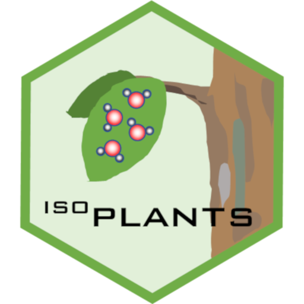

<!-- README.md is generated from README.Rmd. Please edit that file -->

```{r echo=FALSE}
knitr::opts_chunk$set(
  warning = FALSE,
  message = FALSE,
  collapse = TRUE,
  comment = "#>",
  fig.path = "man/figures/README-",
  out.width = "100%"
)
```
# isoplants 


## Modelling stable isotope composition of plant tissue (oxygen and hydrogen)

#### *Note*
This package still is under development

## Description

`isoplants` is a lightweight R package to model the isotopic ratios in in plant tissue and analyze the sensitivity to changes in environmental conditions. It currently focuses on stable oxygen and hydrogen isotopes but will likely also integrate carbon isotopes in future  releases.
It uses the R package [tealeaves](https://CRAN.R-project.org/package=tealeaves) to integrate the calculation of leaf temperatures.

## Get isoplants

From GitHub

```r
install.packages("devtools")
devtools::install_github("dabasler/isoplants")
```

And load isoplants

```r
library("isoplants")
```

## Vignette
```{r child = 'vignettes/isoplants-introduction.Rmd'}
```

## Vignette Sensititivy
```{r child = 'vignettes/isoplants-sensitivity.Rmd'}
```


## Contributors

* [David Basler](https://github.com/dabasler)

<!--
## Comments and contributions

#I welcome comments, criticisms, and especially contributions!
#GitHub issues are the preferred way to report bugs, ask questions, or request new features.
#You can submit issues here:
#https://github.com/dabasler/isoplants/issues
-->

## Meta
<!--
# Please [report any issues or bugs](https://github.com/dabasler/isoplants/issues).
-->

* License: MIT

<!-- * Get citation information for `isoplants` in R doing `citation(package = 'isoplants')` 
* Please note that this project is released with a [Contributor Code of Conduct](CONDUCT.md). By participating in this project you agree to abide by its terms.
-->
