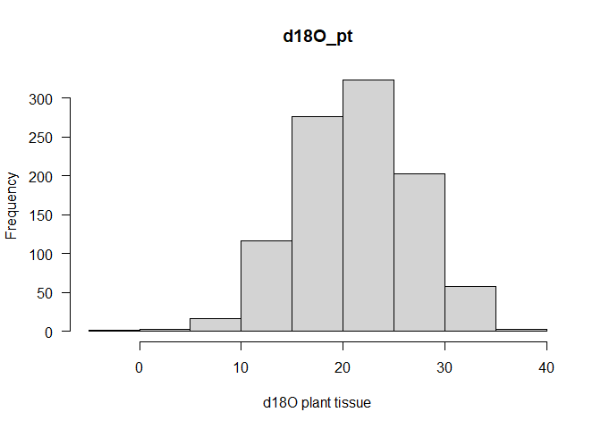
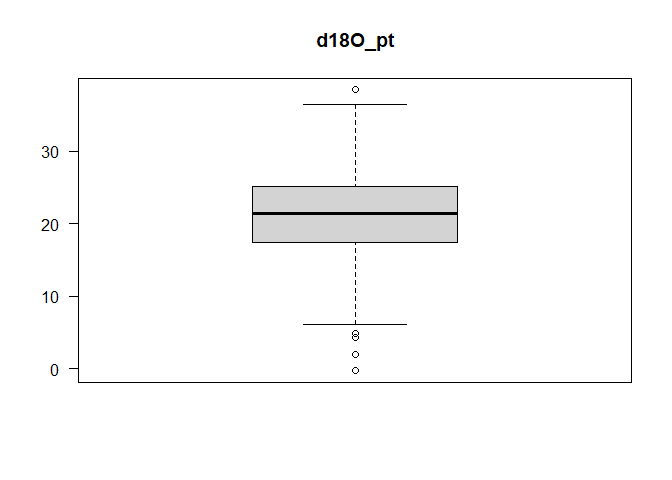
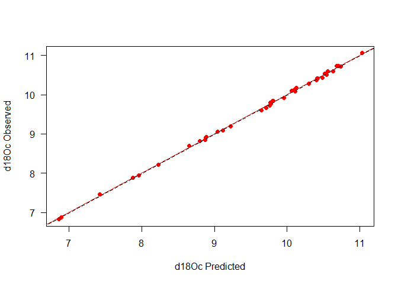
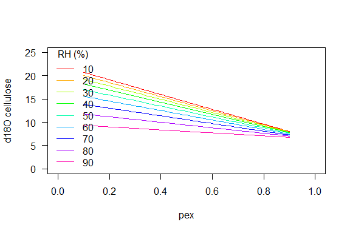
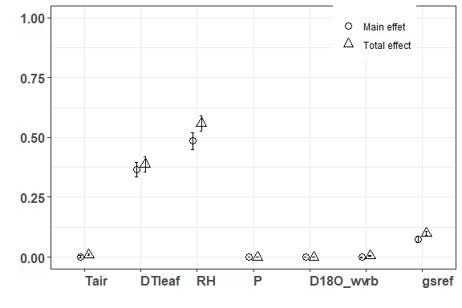
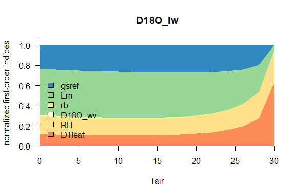

<!-- README.md is generated from README.Rmd. Please edit that file -->

# isoplants 

## Modelling stable isotope composition of plant tissue (oxygen and hydrogen)

#### *Note*

This package still is under development

## Description

`isoplants` is a lightweight R package to model the isotopic ratios in
in plant tissue and analyze the sensitivity to changes in environmental
conditions. It currently focuses on stable oxygen and hydrogen isotopes
but will likely also integrate carbon isotopes in future releases. It
uses the R package
[tealeaves](https://CRAN.R-project.org/package=tealeaves) to integrate
the calculation of leaf temperatures.

## Get isoplants

From GitHub

``` r
install.packages("devtools")
devtools::install_github("dabasler/isoplants")
```

And load isoplants

``` r
library("isoplants")
```

## Vignette

The {isoplants} package allows to calculate isotopic composition of
plant tissue in respone to environmental factors. This vignette shows a
basic example to use the {isoplants} package:

- run a minimum worked example using default parameters
- replace default parameters
- include uncertainty estimates for specific parameters

## Minimum worked example

You can use the models with the default parameter settings using the
`get_default_parameters()` function and `plant18O_model()` or
`plant2H_model()`. Basic information about the interpreters can be
displayed by calling `get_parameter_definition()`. The isotopologue of
the parameter set can be specified using the `element` argument ( `H`
for hydrogen, `O` for oxygen).

``` r

library(magrittr)
library(isoplants)

# Get all default parameters (the default parameters will use include parameters for the Péclet model)
df_parameter <- get_default_parameters() # for oxygen [default], use element='O' to specify oxygen explicitly
result <- plant18O_model(df_parameter)
result %>% knitr::kable()
```

|       ea |       ei | ea_ei |       vpd |       eq |       ek |  gs |         E |   D |        pn |  D18O_e |    d18O_e |  D18O_lw |   d18O_lw |   D18O_c |   d18O_c |  D18O_pt |  d18O_pt |
|---------:|---------:|------:|----------:|---------:|---------:|----:|----------:|----:|----------:|--------:|----------:|---------:|----------:|---------:|---------:|---------:|---------:|
| 1.642629 | 2.346613 |   0.7 | 0.7039839 | 9.793879 | 25.42857 | 0.4 | 0.0019851 |   0 | 0.5429544 | 10.5743 | -9.637182 | 8.159664 | -12.00353 | 32.02799 | 11.38743 | 32.02799 | 11.38743 |

``` r

# The output can also be limited to a specific variable
plant18O_model(df_parameter,output = 'd18O_c')
#> [1] 11.38743

# Similarly, this can also be applied for the hydrogen model
df_parameter <- get_default_parameters(element="H")
result <- plant2H_model(df_parameter)
result %>% knitr::kable()
```

|       ea |       ei | ea_ei |       vpd |      eq |       ek |  gs |         E |   D |        pn |   D2H_e |     d2H_e |   D2H_lw |    d2H_lw |     D2H_c |     d2H_c |    D2H_pt |    d2H_pt |
|---------:|---------:|------:|----------:|--------:|---------:|----:|----------:|----:|----------:|--------:|----------:|---------:|----------:|----------:|----------:|----------:|----------:|
| 1.642629 | 2.346613 |   0.7 | 0.7039839 | 85.0313 | 25.42857 | 0.4 | 0.0019851 |   0 | 0.5374421 | 28.7254 | -53.57263 | 22.22165 | -59.55608 | -28.34695 | -106.0792 | -28.34695 | -106.0792 |

## Parameter Checking

The package includes the `check_parameters()` function which provides
(1) a list of selected model options, (2) basic checking of provided
parameters and, (3) a list of any errors found.

``` r
df_parameter <- get_default_parameters(element="O")
check<-check_parameters(df_parameter) # Run a check on the specified parameters
check$model_options %>% knitr::kable()
```

| model_options                                                                                       |
|:----------------------------------------------------------------------------------------------------|
| Provided 1 set(s) for 12 parameters: Tair, RH, P, d18O_sw, Tleaf, rb, gs, Lm, pex, px, ecp, D18O_wv |
| Leaf temperature: using provided leaf temperature                                                   |
| Mixing: peclet mixing                                                                               |
| Other: D18O of water vapor over soil water assumed to be in equilibrium                             |

``` r
check$model_parameters %>% knitr::kable()
```

|     | group       | name    |    lower | upper |    default | unit            | description                                             | check  | valid | invalid |  na | range      | type       |
|:----|:------------|:--------|---------:|------:|-----------:|:----------------|:--------------------------------------------------------|:-------|------:|--------:|----:|:-----------|:-----------|
| 1   | environment | Tair    | -30.0000 |    50 |  20.000000 | \[deg C\]       | Air Temperature                                         | passed |     1 |       0 |   0 | 20.000000  | constant   |
| 2   | environment | RH      |   0.0000 |   100 |  70.000000 | \[%\]           | relative humidity                                       | passed |     1 |       0 |   0 | 70.000000  | constant   |
| 4   | environment | P       |  40.0000 |   110 | 101.325000 | \[kPa\]         | barometric pressure                                     | passed |     1 |       0 |   0 | 101.325000 | constant   |
| 6   | environment | d18O_sw | -30.0000 |     0 | -20.000000 | \[permil\]      | d18O soil water                                         | passed |     1 |       0 |   0 | -20.000000 | constant   |
| 7   | environment | D18O_wv | -15.0000 |     0 |  -9.793879 | \[permil\]      | D18O of water vapor over soil water                     | passed |     1 |       0 |   0 | -9.793879  | calculated |
| 9   | leaf        | Tleaf   | -30.0000 |    50 |  20.000000 | \[deg C\]       | absolute Leaf temperature                               | passed |     1 |       0 |   0 | 20.000000  | constant   |
| 10  | leaf        | rb      |   0.4000 |     6 |   1.000000 | \[m2 s mol-1\]  | boundary resistance                                     | passed |     1 |       0 |   0 | 1.000000   | constant   |
| 11  | leaf        | gs      |   0.0000 |     2 |   0.400000 | \[mol m-2 s-1\] | stomatal conductance                                    | passed |     1 |       0 |   0 | 0.400000   | constant   |
| 13  | leaf        | Lm      |   0.0001 |     2 |   0.030000 | \[m\]           | Peclet-model scaled path length                         | passed |     1 |       0 |   0 | 0.030000   | constant   |
| 15  | leaf        | pex     |   0.0000 |     1 |   0.400000 | \[\]            | Proportion of O exchanged during cellulose synthesis    | passed |     1 |       0 |   0 | 0.400000   | constant   |
| 16  | leaf        | px      |   0.0000 |     1 |   1.000000 | \[\]            | Proportion of unenriched xylem water in developing cell | passed |     1 |       0 |   0 | 1.000000   | constant   |
| 17  | leaf        | ecp     | -10.0000 |    10 |   0.000000 | \[permil\]      | offset from cellulose to bulk leaf material             | passed |     1 |       0 |   0 | 0.000000   | constant   |

``` r
check$errors %>% knitr::kable() # should be empty
```

<table class="kable_wrapper">
<tbody>
<tr>
<td>
</td>
</tr>
</tbody>
</table>

## Replace parameters

The input parameter data.frame object can have multiple rows. Here we
calculate d18O_lt for different values of RH.

``` r
# Run model on default parameters, manipulating one parameter (RH)
RH<-seq(10,90,10)
# PArameters can be set using the set_parameter function
df_parameter<-get_default_parameters()
df_parameter<-set_parameters(data.frame(RH),df_parameter)
# OR by assigning them directly to a parameter table with the appropriate number of rows
df_parameter<-get_default_parameters(n=length(RH), mode='peclet')
df_parameter$RH<-RH
#run model
result<-plant18O_model(df_parameter)
plot(df_parameter$RH,result$d18O_pt,xlab='RH',ylab='d18O_lt',pch=19,las=1)
```


## Parameter uncertainty

The included fuction `get_randomized_parameters()` samples n
parametersets from parameter specific distributions in order to estimate
the effect of uncertainty of input parameters. `set_parameters()`
combines fixed parameters with a set of varying parameters.

``` r
# Run model on default parameters with uncertainty on multiple parameter

# Get default parameters
df_parameter<-get_default_parameters(mode='peclet')
# Defines ranges and distributions for parameters (see ?get_randomized_parameters for detailed information on the imput format and further options)
rnd_par <- data.frame(name= c('RH',   'd18O_sw', 'pex'   ),
                      pdist=c('norm', 'norm'   , 'unif' ),
                      pdm=  c(70,      -10     , 0.4    ),
                      pdv=  c(20,       5      , 0.2    ),
                      stringsAsFactors = FALSE
                      )

n<-1000 # Number of samples

df_parameter <- set_parameters(get_randomized_parameters(n,rnd_par) , df_parameter)
result<-plant18O_model(df_parameter)
```

``` r
hist(result$d18O_pt,main = 'd18O_pt',xlab='d18O plant tissue',las=1)
boxplot(result$d18O_pt,main = 'd18O_pt',las=1)
```



## Optimize a set of parameters

Quite often, a set of parameters need to be fitted to some training data
in order to produce a operational model.{Isoplants} allows for very
simple parameter optimization when measured data is available.

``` r

# prepare dataset with some randomized sample data
n<-40
observed_data <- get_default_parameters(n)
observed_data$Tair <- rnorm(n,20,4)
observed_data$RH   <- rnorm(n,70,10)
observed_data$Lm   <- 0.06  # The fitting procedure should produce something close to this value
observed_data$pex   <- 0.5   # The fitting procedure should produce something close to this value
# create some 'measured' vaules are added to the data.frame as 'd18O_cellulose'
# (ensure not to use a parameter name)
noise<-(runif(n)-0.5)/10
observed_data$d18O_cellulose <- plant18O_model(observed_data,output='d18O_c') + noise
# Always ensure that there are no NA values in the observed values
observed_data<-observed_data[!is.na(observed_data$d18O_cellulose),]


# Fit the parameters "Lm" and "px" (this might take a while)
parfit<-fit_plant18O(c("Lm","pex"), observed_data, obsvalue = "d18O_cellulose", modvalue ="d18O_c")
#> [1] "parameter: Lm  |   boundaries: 0.0001 <= Lm   >= 2.0000     | initial value: Lm = 0.0300"
#> [1] "parameter: pex  |   boundaries: 0.0000 <= pex   >= 1.0000     | initial value: pex = 0.4000"
#> [1] "done"

print (parfit$par)
#>         Lm        pex 
#> 0.06009428 0.49929524
# Run model on best parameters
run_par<-get_run_parameters(observed_data,parfit$par)
modelout<-plant18O_model(run_par)
result<-cbind(observed_data,modelout)
```

``` r

# Plot predicted vs observed
plot(d18O_cellulose~d18O_c,data=result,xlab='d18Oc Predicted',ylab='d18Oc Observed',las=1,pch=19,col='red')
segments(0,0,100,100,lty=2)
abline(lm(d18O_cellulose~d18O_c,data=result),col='red')
```



## Leaf temperature model

The `isoplants` package is designed to work with the leaf temperature
modelling package `tealeaves` (Muir 2019) to estimate leaf temperature
in various environmental conditions or integrate the feedback effect of
stomatal conductance on leaf temperature into the isoplants model.

``` r

# Get a isoplants parameterset, including default values for radiation windspeed and leaf size
df_parameter<-get_default_parameters(tealeaves = TRUE) 

# Set swrad to irradiance at 800 w/m2
df_parameter$swrad<-300

#set a range of values for stomatal conductance
df_parameter<-set_parameters(data.frame(gs=seq(0.04,0.5,0.01)),df_parameter) 
#update the  parameter set with Tleaf and rb as estimated from the tealeaves model
df_parameter<-calculate_Tleaf(df_parameter) 
# run the 18O isotope model
result_with_Tleaf<-plant18O_model(df_parameter)

# Run again setting Tleaf=Tair to show the effect of integrating Tleaf
df_parameter_without_Tleaf<-df_parameter
df_parameter_without_Tleaf$Tleaf<-df_parameter_without_Tleaf$Tair
result_without_Tleaf<-plant18O_model(df_parameter_without_Tleaf)
```

``` r

plot(df_parameter$Tleaf~df_parameter$gs,las=1,xlab='gs (mol m-2 s-1)',ylab='Leaf tempertaure (°C)',type='l')
legend("topright","Air temperature 20°C",cex=0.8,bty="n")

plot(result_with_Tleaf$d18O_pt~df_parameter$gs,las=1,xlab='gs (mol m-2 s-1)',ylab='d18O plant tissue (‰)',type='l',lwd=2,col="#00AFBB")
lines(result_without_Tleaf$d18O_pt~df_parameter_without_Tleaf$gs,lty=2,lwd=2,col="#FC4E07")
legend('bottomleft',lty=c(1,2),lwd=2,c('incl.leaf temperature effect','excl. leaf temperature effect'),col=c(col="#00AFBB","#FC4E07"),bty='n',cex=0.8)
```


## Piso.AI API interaction

One of the most important parameter for the isotopic composition of
plant tissue is the isotopic composition of source water (d18O_sw).
Often this is approximated by using site-specific data on the isotopic
composition of precipitation. The {isoplants} package interacts with the
Piso.AI API to these data.
[Piso.AI](https://isotope.bot.unibas.ch/PisoAI/) is tool for predicting
monthly time series of oxygen and hydrogen isotope values of
precipitation that uses a machine learning model trained on geographic
and climate data. The Piso.AI v1.0 data set covers most of Europe and
covers the time span from 1950-01-01 to 2019-12-31. Below is an example
of the basic data requests from the Piso.AI api using the tools provided
in {isoplants}:

``` r
# Simple request for Piso.AI data of two locations and the full time span of Piso.AI
location<-data.frame(site= c("TEST1","TEST2") ,latitude=c(45.7,46.5),longitude=c(7.6,8.0))
pisoai_data <- get_pisoai_data(location)

# Request for Piso.AI data of two locations and specific timespan
pisoai_data <- get_pisoai_data(location, years=c(1990,2000),months=c(4,6))

# Request for Piso.AI data of two locations individual years
location<-data.frame(site= c("TEST1","TEST2") ,latitude=c(45.7,46.5),longitude=c(7.6,8.0),years=c(1979,2010),stringsAsFactors = FALSE)
pisoai_data <- get_pisoai_data(location)

# Similar request, additionally storing data locally
pisoai_data <- get_pisoai_data(location,storelocal='~/PisoAI_data')
# read back local data
pisoai_data <- pisoai_readlocal('~/PisoAI_data')
```

## Vignette Sensititivy

The models in the {isoplants} package are include various environmental
and leaf specific input parameters. The package includes functions to
analyze the sensitivity to changes in the input variables This vignette
shows some basic example to do some sensitivity analysis with
{isoplants}:

## Direct sensitivity analysis

For example, we can look at how d18O of cellulose is affected by
different pex values under a set of different RH conditions.

``` r
library(isoplants)

pex<-seq(0.1,0.9,0.01)
lf18Opar<-get_default_parameters(n=length(pex))

lf18Opar$pex<-pex
result<-plant18O_model(lf18Opar)
```

``` r

plot(lf18Opar$pex,result$d18O_c,ylim=c(0,25),xlim=c(0,1),type='l',las=1,xlab='pex',ylab='d18O cellulose')
rhs<-seq(10,90,10)
col<-rainbow(length(rhs))
for (i in 1:length(rhs)){
  lf18Opar$RH<-rhs[i]
  result<-plant18O_model(lf18Opar)
  lines(lf18Opar$pex,result$d18O_c,col=col[i])
}
legend('bottomleft',as.character(rhs),col=col,lty=1,title = 'RH (%)',bty='n')
```



## Sobol incices

Sobol incices are a Global form of sensitivity indices whereby the
variance of the output of the model is decomposed into fractions which
can be attributed to individual input parameters or from the interaction
between parameters. Here we analyze the sensitivity of d18O cellulose to
changes in the input parameters.

``` r
# Sensitivity analysis (with sobol indices)

library('sensitivity')
library('boot')
library('ggplot2')

# Define parameter ranges (min-max)
rnd_par <- data.frame(
  name  = c("Tair","DTleaf","RH",  "P", "d18O_sw","D18O_wv","rb", "Lm", "gsref", "px", "pex"),
  pdist = 'minmax',
  pdm   = c(     5,     -5,  30,   90.0,       -30,     -20, 0.4, 0.001,    0.01 ,  0.8,  0.4),
  pdv    = c(    30,      10,  95, 102.0 ,       0,       0,   5,    0.5,     0.6 ,  0.8,  0.4),
  stringsAsFactors = FALSE
)
#Initialize two random parameter sets
n<-10000
X1 <- get_randomized_parameters(n,rnd_par)
X2 <- get_randomized_parameters(n,rnd_par)

x <- sobol2007(model =plant18O_model, X1 = X1, X2 = X2, nboot = 1000, output = "d18O_c")
```

``` r
ggplot(x)
```


### Fixing some parameters

The `plant18O_model()` model allows to pass some parameters with the
`addpar` argument. These will be internally joined with the main
parameters, but allow for the exclusion of these parameters in certain
kinds of analysis. Here we analyze the sensitivity of d18O leaf water to
changes in the input parameters (excluding variation in soil water, and
the parameters for the steps after the calculation of leaf water).

``` r
# Calculate Sobol indices with a set of fixed parameters (set to default values)
fixpar <- get_default_parameters()[,c('d18O_sw','Lm','px','pex','ecp')]
n<-10000
# Using the previously defined parameter ranges (rnd_par), excluding the fixed parameters
X1 <- get_randomized_parameters(n,rnd_par)[,!names(fixpar) %in% names (rnd_par)]
X2 <- get_randomized_parameters(n,rnd_par)[,!names(fixpar) %in% names (rnd_par)]
X1<-X1[,!names(X1) %in% names (fixpar)]
X2<-X2[,!names(X2) %in% names (fixpar)]

x <- sobol2007(model =plant18O_model, X1 = X1, X2 = X2, nboot = 1000, output = "d18O_lw",addpar=fixpar)
```

``` r
ggplot(x)
```



### Parmeter gradients

In order to analyze the importance of multiple input parameters across a
gradient of a certain parameter, we can use the `scan_sensitivity()`
function

``` r
n<-10000
X1 <- get_randomized_parameters(n,rnd_par)
X2 <- get_randomized_parameters(n,rnd_par)
fixpar <- get_default_parameters()[,c('d18O_sw','P','px','pex')]
scanpar<-"Tair"
ts<-seq(0,30,2)
ss<-scan_sensitivity(X1,X2,fixpar,ts,scanpar,outpar="D18O_lw")
#> [1] 0
#> [1] 2
#> [1] 4
#> [1] 6
#> [1] 8
#> [1] 10
#> [1] 12
#> [1] 14
#> [1] 16
#> [1] 18
#> [1] 20
#> [1] 22
#> [1] 24
#> [1] 26
#> [1] 28
#> [1] 30
```

``` r
plot_sensitivity(ss$ds,scanpar,'normalized first-order indices','D18O_lw',parcol = 1,legend = TRUE)
```



``` r
plot_sensitivity(ss$dt,scanpar,'normalized total indices','',parcol = 1,legend = TRUE)
```


## Contributors

- [David Basler](https://github.com/dabasler)

<!--
## Comments and contributions

#I welcome comments, criticisms, and especially contributions!
#GitHub issues are the preferred way to report bugs, ask questions, or request new features.
#You can submit issues here:
#https://github.com/dabasler/isoplants/issues
-->

## Meta

<!--
# Please [report any issues or bugs](https://github.com/dabasler/isoplants/issues).
-->

- License: MIT

<!-- * Get citation information for `isoplants` in R doing `citation(package = 'isoplants')` 
* Please note that this project is released with a [Contributor Code of Conduct](CONDUCT.md). By participating in this project you agree to abide by its terms.
-->

## Acknowledgements

This project has received funding from the European Research Council
(ERC) to Ansgar Kahmen under the European Union’s Horizon 2020 research
and innovation programme (grant agreement No 724750).
