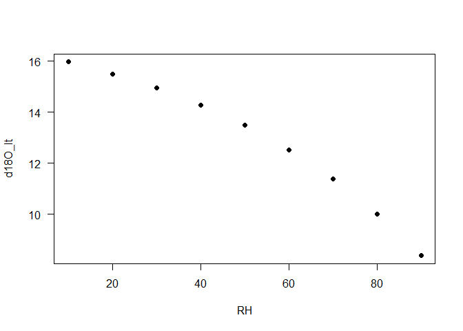
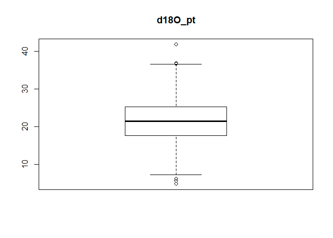

<!-- README.md is generated from README.Rmd. Please edit that file -->
<!--# isoplants  -->
Modelling stable isotope composition of plant tissue
----------------------------------------------------

#### *Note*

This package is under development and may yet produce unstable results

Description
-----------

{isoplants} is a lightweight R package to model the isotopic ratios in in plant tissue and analyze the sensitivity to changes in environmental conditions. It currently focuses on stable Oxygen isotopes but will integrate Carbon and possibly Hydrogen isotopes in future releases. It uses the R package [tealeaves](https://CRAN.R-project.org/package=tealeaves) to integrate the calculation of leaf temperatures.

Get isoplants
-------------

From GitHub

``` r
install.packages("devtools")
devtools::install_github("dabasler/isoplants")
```

And load isoplants

``` r
library("isoplants")
```

Vignette
--------

The {isoplants} package allows to calculate isotopic composition of plant tissue in respone to environmental factors. This vignette shows a basic example to usse the {isoplants} package:

-   run a minimum worked example using default parameters
-   replace default parameters
-   include uncertainty estimates for specific parameters

Minimum worked example
----------------------

You can use the models with the default parameter settings using the `get_default_parameters()` function and `leaf18O_model()`. Basic information about the inputparmeters can be displayed by calling `get_parameter_definition()`.

``` r

library(magrittr)
library(isoplants)

# Get all default parameters (the default parameters will use include parameters for the peclet model)
df_parameter<-get_default_parameters()
result<-leaf18O_model(df_parameter)
result %>% knitr::kable()
```

|        ea|        ei|  ea\_ei|        vpd|        eq|        ek|   gs|          E|    D|         pn|   D18O\_e|    d18O\_e|  D18O\_lw|  d18O\_lw|   D18O\_c|   d18O\_c|  d18O\_pt|  d18O\_pt|
|---------:|---------:|-------:|----------:|---------:|---------:|----:|----------:|----:|----------:|---------:|----------:|---------:|---------:|---------:|---------:|---------:|---------:|
|  1.642629|  2.346613|     0.7|  0.7039839|  9.806829|  25.42857|  0.4|  0.0019851|    0|  0.5429544|  10.57811|  -9.633452|  8.162601|  -11.8374|  31.89756|  11.25961|  11.25961|  11.25961|

``` r


# The output can also be limited to a specific variable
leaf18O_model(df_parameter,output = 'd18O_c')
#> [1] 11.25961
```

Parameter Checking
------------------

The package includes the `check_parameters()` function which provides (1) a list of selected model options, (2) basic checking of provided parameters and (3), a list of any errors found.

``` r

check<-check_parameters(df_parameter) # Run a check on the specified parameters

check$model_options %>% knitr::kable()
```

<table>
<colgroup>
<col width="100%" />
</colgroup>
<thead>
<tr class="header">
<th align="left">model_options</th>
</tr>
</thead>
<tbody>
<tr class="odd">
<td align="left">Provided 1 set(s) for 12 parameters: Tair, RH, P, d18O_sw, Tleaf, rb, gs, Lm, px, pex, ecp, D18O_wv</td>
</tr>
<tr class="even">
<td align="left">Mixing: peclet mixing</td>
</tr>
<tr class="odd">
<td align="left">Other: D18O of water vapor over soil water assumed to be in equilibrium</td>
</tr>
</tbody>
</table>

``` r
check$model_parameters %>% knitr::kable()
```

|     | group       | name     |     lower|  upper|     default| unit            | description                                 | check  |  valid|  invalid|   na| range      | type       |
|-----|:------------|:---------|---------:|------:|-----------:|:----------------|:--------------------------------------------|:-------|------:|--------:|----:|:-----------|:-----------|
| 1   | environment | Tair     |  -30.0000|     50|   20.000000| \[deg C\]       | Air Temperature                             | passed |      1|        0|    0| 20.000000  | constant   |
| 2   | environment | RH       |    0.0000|    100|   70.000000| \[%\]           | relative humidity                           | passed |      1|        0|    0| 70.000000  | constant   |
| 4   | environment | P        |   40.0000|    110|  101.325000| \[kPa\]         | barometric pressure                         | passed |      1|        0|    0| 101.325000 | constant   |
| 6   | environment | d18O\_sw |  -30.0000|      0|  -20.000000| \[permil\]      | d18O soil water                             | passed |      1|        0|    0| -20.000000 | constant   |
| 7   | environment | D18O\_wv |  -15.0000|      0|   -9.806829| \[permil\]      | D18O of water vapor over soil water         | passed |      1|        0|    0| -9.806829  | calculated |
| 9   | leaf        | Tleaf    |  -30.0000|     50|   20.000000| \[deg C\]       | absolute Leaf temperature                   | passed |      1|        0|    0| 20.000000  | constant   |
| 10  | leaf        | rb       |    0.4000|      6|    1.000000| \[m2 s mol-1\]  | boundary resistance                         | passed |      1|        0|    0| 1.000000   | constant   |
| 11  | leaf        | gs       |    0.0000|      2|    0.400000| \[mol m-2 s-1\] | stomatal conductance                        | passed |      1|        0|    0| 0.400000   | constant   |
| 13  | leaf        | Lm       |    0.0001|      2|    0.030000| \[m\]           | Peclet-model scaled path length             | passed |      1|        0|    0| 0.030000   | constant   |
| 15  | leaf        | px       |    0.0000|      1|    0.400000| \[\]            | conversion parameter for cellulose          | passed |      1|        0|    0| 0.400000   | constant   |
| 16  | leaf        | pex      |    0.0000|      1|    1.000000| \[\]            | conversion parameter for cellulose          | passed |      1|        0|    0| 1.000000   | constant   |
| 17  | leaf        | ecp      |  -10.0000|     10|    0.000000| \[permil\]      | offset from cellulose to bulk leaf material | passed |      1|        0|    0| 0.000000   | constant   |

``` r
check$errors %>% knitr::kable() # should be empty
```

<table class="kable_wrapper">
<tbody>
<tr>
<td>
</td>
</tr>
</tbody>
</table>
Replace parameters
------------------

The input parameter data.frame object can have multiple rows. Here we calculate d18O\_lt for different values of RH.

``` r
# Run model on default parameters, manupulating one parameter (RH)
RH<-seq(10,90,10)
# PArameters can be set using the set_parameter function
df_parameter<-get_default_parameters()
df_parameter<-set_parameters(data.frame(RH),df_parameter)
# OR by assigning them directly to a parametertable with the appropriate number of rows
df_parameter<-get_default_parameters(n=length(RH), mode='peclet')
df_parameter$RH<-RH
#run model
result<-leaf18O_model(df_parameter)
plot(df_parameter$RH,result$d18O_bulk,xlab='RH',ylab='d18O_lt',pch=19,las=1)
```



Parameter uncertainty
---------------------

The included fuction `get_randomized_parameters()` samples n parametersets from parameter specific distributions in order to estimate the effect of uncertainty of input parameters. `set_parameters()` combines fixed parameters with a set of varying parameters.

``` r
# Run model on default parameters with uncertainty on multiple parameter

# Get default parameters
df_parameter<-get_default_parameters(mode='peclet')
# Defines ranges and distributions for parameters (see ?get_randomized_parameters for detailed information on the imput format and further options)
rnd_par <- data.frame(name= c('RH',   'd18O_sw', 'px'   ),
                      pdist=c('norm', 'norm'   , 'unif' ),
                      pdm=  c(70,      -10     , 0.4    ),
                      pdv=  c(20,       5      , 0.2    ),
                      stringsAsFactors = FALSE
                      )

n<-1000 # Number of samples

df_parameter <- set_parameters(get_randomized_parameters(n,rnd_par) , df_parameter)
result<-leaf18O_model(df_parameter)
```

``` r
hist(result$d18O_pt,main = 'd18O_pt',xlab='d18O plant tissue')
boxplot(result$d18O_pt,main = 'd18O_pt')
```



['vignettes/isoplants-introduction.Rmd')](../doc/isoplants-sensitivity.html)

Contributors
------------

-   [David Basler](https://github.com/dabasler)

<!--
## Comments and contributions

#I welcome comments, criticisms, and especially contributions!
#GitHub issues are the preferred way to report bugs, ask questions, or request new features.
#You can submit issues here:
#https://github.com/dabasler/isoplants/issues
-->
Meta
----

<!--
# Please [report any issues or bugs](https://github.com/dabasler/isoplants/issues).
-->
-   License: MIT

<!-- * Get citation information for `isoplants` in R doing `citation(package = 'isoplants')` 
* Please note that this project is released with a [Contributor Code of Conduct](CONDUCT.md). By participating in this project you agree to abide by its terms.
-->
